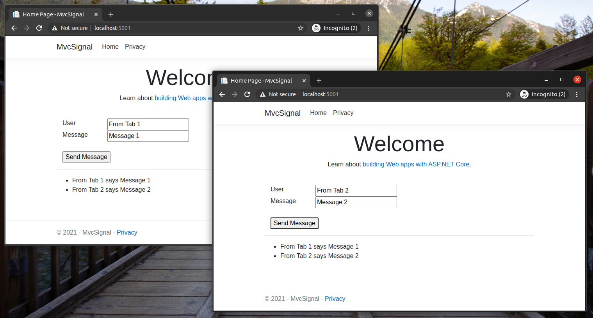

# MVC Signal

## Description

Example using SignalR to communicate with the server through sockets

## Run the application

```
dotnet restore -v n

dotnet run 
```



## Commands

```
dotnet add package Microsoft.AspNet.SignalR --version 2.4.1

dotnet tool install -g Microsoft.Web.LibraryManager.Cli

libman install @microsoft/signalr@latest -p unpkg -d wwwroot/js/signalr --files dist/browser/signalr.js --files dist/browser/signalr.min.js
```

## Snippets

- `wwwroot/js/chat.js`
- `Views/Home/Index.cshtml`
- `ChatHub.cs`
- `Startup.cs`

## Credits

- [Get started with ASP.NET Core SignalR](https://docs.microsoft.com/en-us/aspnet/core/tutorials/signalr?view=aspnetcore-3.1&tabs=visual-studio-code)